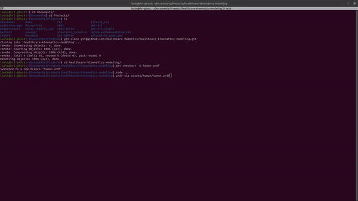

# Assistive Gym v1.0
#### v1.0 (this branch) has been released! See the feature list below for what is new in v1.0.  
#### Assistive Gym in also now supported in Google Colab! For example: [](https://colab.research.google.com/drive/1qFbjuq5lFxPijyw4PFUiZw2sFpXTR7ok?usp=sharing)  
#### See the [Wiki](https://github.com/Healthcare-Robotics/assistive-gym/wiki/7.-Google-Colab) for all available Google Colab examples.
***

Assistive Gym is a physics-based simulation framework for physical human-robot interaction and robotic assistance.

Assistive Gym is integrated into the OpenAI Gym interface, enabling the use of existing reinforcement learning and control algorithms to teach robots how to interact with people. 


### Paper
A paper on Assistive Gym can be found at https://arxiv.org/pdf/1910.04700.pdf

Z. Erickson, V. Gangaram, A. Kapusta, C. K. Liu, and C. C. Kemp, “Assistive Gym: A Physics Simulation Framework for Assistive Robotics”, IEEE International Conference on Robotics and Automation (ICRA), 2020.
```
@article{erickson2020assistivegym,
  title={Assistive Gym: A Physics Simulation Framework for Assistive Robotics},
  author={Erickson, Zackory and Gangaram, Vamsee and Kapusta, Ariel and Liu, C. Karen and Kemp, Charles C.},
  journal={IEEE International Conference on Robotics and Automation (ICRA)},
  year={2020}
}
```

## Install
### Google Colab
[](https://colab.research.google.com/drive/1PAY5HnLKRB-TBsPaevRr6myMfpVt_yzF?usp=sharing)  
[Try out Assistive Gym in Google Colab.](https://colab.research.google.com/drive/1PAY5HnLKRB-TBsPaevRr6myMfpVt_yzF?usp=sharing) Assistive Gym is fully supported in Google Colab (online Python Jupyter notebook). Click on the link above for an example. Everything runs online, so you won't need to install anything on your local machine!

All of the available Google Colab examples are listed on the [Wiki-Google Colab](https://github.com/Healthcare-Robotics/assistive-gym/wiki/7.-Google-Colab)

### Basic install (if you just want to use existing environments without changing them)
```bash
pip3 install --upgrade pip
pip3 install git+https://github.com/Healthcare-Robotics/assistive-gym.git
```

We recommend using Python 3.6 or 3.7 (although other Python 3.x versions may still work). You can either download [Python 3.6 here](https://www.python.org/downloads/), or use [pyenv](https://github.com/pyenv/pyenv) to install Python 3.6 in a local directory, e.g. `pyenv install 3.6.5; pyenv local 3.6.5`. Both Python 3.6.5 and 3.7.10 have been tested working.

### Full installation (to edit/create environments) using a python virtual environment
We encourage installing Assistive Gym and its dependencies in a python virtualenv.  
Installation instructions for Windows can also be found in the [Install Guide](https://github.com/Healthcare-Robotics/assistive-gym/wiki/1.-Install#installing-on-windows).
```bash
python3 -m pip install --user virtualenv
python3 -m venv env
source env/bin/activate
pip3 install --upgrade pip
git clone https://github.com/Healthcare-Robotics/assistive-gym.git
cd assistive-gym
pip3 install -e .
```


## Getting Started
We provide a [10 Minute Getting Started Guide](https://github.com/Healthcare-Robotics/assistive-gym/wiki/3.-Getting-Started) to help you get familiar with using Assistive Gym for assistive robotics research.

You can visualize the various Assistive Gym environments using the environment viewer.  
A full list of available environment can be found [Here (Environments)](https://github.com/Healthcare-Robotics/assistive-gym/wiki/2.-Environments).
```bash
python3 -m assistive_gym --env "FeedingJaco-v1"
```

We provide pretrained control policies for each robot and assistive task.  
See [Running Pretrained Policies](https://github.com/Healthcare-Robotics/assistive-gym/wiki/4.-Running-Pretrained-Policies) for details on how to run a pretrained policy.

See [Training New Policies](https://github.com/Healthcare-Robotics/assistive-gym/wiki/5.-Training-New-Policies) for documentation on how to train new control policies for Assistive Gym environments.

Finally, [Creating a New Assistive Environment](https://github.com/Healthcare-Robotics/assistive-gym/wiki/6.-Creating-a-New-Assistive-Environment) discusses the process of creating an Assistive Gym environment for your own human-robot interaction tasks.

#### See a list of [common commands available in Assistive Gym ](https://colab.research.google.com/drive/17Rybu4d2UHIC9D0UA1Au8WSDExX2mMgb?usp=sharing)

## New Features in v1.0
### Clean code syntax
#### v1.0 example (getting robot left end effector velocity)
```python
end_effector_velocity = self.robot.get_velocity(self.robot.left_end_effector)
```
#### Old v0.1 (using default PyBullet syntax)
```python
end_effector_velocity = p.getLinkState(self.robot, 76 if self.robot_type=='pr2' else 19 if self.robot_type=='sawyer' 
                                       else 48 if self.robot_type=='baxter' else 8, computeForwardKinematics=True, 
                                       computeLinkVelocity=True, physicsClientId=self.id)[6]
```

### Google Colab Support
[](https://colab.research.google.com/drive/1PAY5HnLKRB-TBsPaevRr6myMfpVt_yzF?usp=sharing)  
Assistive Gym is now supported in Google Colab! Tons of new examples are now available for developing and learning with Assistive Gym in Google Colab. See the [Wiki-Google Colab](https://github.com/Healthcare-Robotics/assistive-gym/wiki/7.-Google-Colab) for a list of all the available example notebooks.

### Support for mobile bases (mobile manipulation)
For robots with mobile bases, locomotion control is now supported. Ground frictions and slip can be dynamically changed for domain randomization.

Reference this [Google Colab notebook ](https://colab.research.google.com/drive/1pfYvTcHK1LF8M9p4Gp31S8SziWIiN0Sq?usp=sharing) for an example of mobile base control.  
&nbsp;  


### Support for the Stretch and PANDA robots


### Multi-robot control support
Assitive Gym now provides an interface for simulating and controlling multiple robots and people, all through the OpenAI Gym framework. See this example of [multi-robot control ](https://colab.research.google.com/drive/1NPWZNFpB9NCgTQpbwM78jVHJAC7q_0oR?usp=sharing).  
&nbsp;  


### Integration with iGibson
Assistive Gym can now be used with [iGibson](http://svl.stanford.edu/igibson/) to simulate human-robot interaction in a visually realistic interactive home environment.  
An example of using iGibson with Assistive Gym is available in [this Google Colab notebook ](https://colab.research.google.com/drive/1qFbjuq5lFxPijyw4PFUiZw2sFpXTR7ok?usp=sharing).  
&nbsp;  


### Static human mesh models (with SMPL-X)
SMPL-X human mesh models are now supported in Assistive Gym. See this [wiki page](https://github.com/Healthcare-Robotics/assistive-gym/wiki/8.-Human-Mesh-Models-with-SMPL-X) for details of how to use these human mesh models.

A Google Colab example of building a simple robot-assisted feeding environment with SMPL-X human meshes is also available: [Assistive Gym with SMPL-X in Colab ](https://colab.research.google.com/drive/1gz2mQmkTf9g1Jvo6_-WgSQ60cgGHmGOt?usp=sharing)  
&nbsp;  


***

## Base Features
### Human and robot models 
Customizable female and male human models (default body sizes and weights matching 50th percentile humans).  
40 actuated human joints (head, torso, arms, waist, and legs)  
&nbsp;  
  
&nbsp;  
Four collaborative robots (PR2, Jaco, Baxter, Sawyer).  
&nbsp;  

### Realistic human joint limits
Building off of prior research, Assistive Gym provides a model for realistic pose-dependent human joint limits.  
&nbsp;  

### Robot base pose optimization
A robot's base pose can greatly impact the robot’s ability to physically assist people.  
We provide a baseline method using joint-limit-weighted kinematic isotopy (JLWKI) to select good base poses near a person.  
With JLWKI, the robot chooses base poses (position and yaw orientation) with high manipulability near end effector goals.  
&nbsp;  

### Human preferences
During assistance, a person will typically prefer for the robot not to spill water on them, or apply large forces to their body.  
Assistive Gym provides a baseline set of human preferences unified across all tasks, which are incorporated directly into the reward function.
This allows robots to learn to provide assistance that is consist with a person's preferences.  
&nbsp;  


Refer to [the paper](https://arxiv.org/abs/1910.04700) for details on features in Assistive Gym.


# Note on installation for Human comfort handover on Ubuntu 20
## Setup dependency 
Run this script, it will install everything needed for the handover project
```bash
cd assistive_gym/scripts/setup
bash setup_env.sh
```
## Copy necessary data 
- Copy the data (urdf, smpl) by modify and running copy_data.sh to copy from another machine in local network
```bash
cd assistive_gym/scripts/setup
bash copy_data.sh
```
- Since the obj file path in urdf is absolute path, you might need to change it. Update the path and run the process_urdf.sh 
```bash
cd assistive_gym/scripts/setup
bash process_urdf.sh
```


# Some new update for the human comfort handover 
We have redesigned our articulated human model to replace capsule model. For each individual, an URDF and associated meshes are generated by our system and closely match the SMPL mesh model.



More details can be found in this project [URDF modelling](https://github.com/Healthcare-Robotics/healthcare-kinematics-modeling)

For the handover, we have added the following features:
- Cane, cup, pill are supported 
- SLP3D dataset (102 individuals, 45 poses for each individual) is supported 
- Robot IK is calculated in handover optimization for feedback
- Batch training (using multiprocessing for multiple poses) is supported, to reduce overall training time 
- Parallel training (using multiprocessing for individual pose) is supported, to reduce the online (realtime) training time


# Train human comfort
## Commandline mode (not well maintained - not recommended)
### Flag meaning
- Supported train/ render mode: 
  - train with gui: `--render-gui --train`
  - train without gui: `--train`
  - render train result: `--render`

- Supported handover object: 
    - single object: `--handover-object "cup"/ "cane"/ "pill"`
    - train all objects: `--handover-obj 'all'`
  
- Supported train mode:
  - with robot ik and real handover object in loop: `--robot-ik`
  - without robot ik and simulated collision object on end-effector (default): omit `--robot-ik` flag
  
### Command
```bash
# pyenv eval "$(pyenv init -)" -> python 3.7.10
cd assistive-gym/
# train
python3 -m assistive_gym.train --env "HumanComfort-v1" --smpl-file "examples/data/smpl_bp_ros_smpl_4.pkl" --save-dir "trained_models" --train --render-gui --robot-ik --handover-obj 'cane'

# render
python3 -m assistive_gym.train --env "HumanComfort-v1" --smpl-file "examples/data/smpl_bp_ros_smpl_4.pkl" --save-dir "trained_models" --render --handover-obj 'cane'
```
## Batch training mode (recommended)
This mode is to run train and render in parallel, for all samples inside a folder/ a dataset

- Modify `batch_train.py` and `batch_render.py` for train and render the result (on the original slp3d dataset)
- Modify `batch_train_augmented_data.py` for train on augmented dataset

```
conda deactivate # deactivate conda env (if conda is on)
eval "$(pyenv init -)" # activate pyenv env
python3 batch_train.py
```

The training will be running multiprocessed based on the number of workers you set. Also, remember to change the following: 
```python 
# Number of workers for multiprocessing
NUM_WORKERS = 32 # for 32 cores

# Person you want to train
PERSON_IDS = ['p001', 'p002', 'p003', 'p004', 'p005', 'p006', 'p007', 'p008', 'p009', 'p010'] 

# SMPL file you want to train for that person (here it will loop through all the person and smpl file 1-10 for each person 1-10)
SMPL_FILES = ['s01', 's02', 's03', 's04', 's05', 's06', 's07', 's08', 's09', 's10']

# Handover object you want to train on
OBJECTS = ['cane', 'cup', 'pill']

# Change the environment name - it will save to the corresponding folder
ENV_NAME = 'HumanComfort-v1-xxx-yyy'
```

The default train will run in headless mode and render will run in gui mode. You can change it in assistive_gym/train.py

```python
RENDER_GUI = True # True for render gui, False for headless
```

## Realtime training mode (for demo purpuse) 
The concept of realtime train mode is to run a single smpl (or single scan) as fast as possible. Since we are using CMAES to search, the algorithm will give multiple solutions for each iteration. To make it faster, we will run all solutions in parallel

Run 
```bash
bash realtime_assistive_gym.sh # will trigger assistive-gym/realtime_train.py which call mptrain.py for multiprocessing
```
Or trigger realtime_train.py directly with args commands

# How to train Neural Network for Human Comfort Handover
## Environment
- Ubuntu 20.04
- pytorch 2.0 (latest)

## Data 
Both real data and augmented data folder can be modified as your wish. Here is the current setting
- Real data (collected from SLP3D dataset) - dataset = `deepnn/preprocess/custom_dataset.py`
  - Convert the SLP3D dataset to json format and put under `deepnn/data/input/searchinput/`
  - Copy the train results from CMAES and put under `deepnn/data/input/searchoutput/`
- Augmented data (collected with augmented dataset) - dataset = `deepnn/preprocess/augmented_dataset.py`
  - Convert the SLP3D dataset to json format and put under `synthetic_dataset/smpl/compressed_data`
  - Copy the train results from CMAES and put under `results/HumanComfort-v1_augmented`

## Train
- We have 2 versions of modelling
  - `deepnn/train_nn.py` - Loss function = MSE angle loss 
  - `deepnn/train_nn_smpl.py` - Loss function = MSE angle loss + MSE joint position loss. For every joint angle configuration that NN generated, we subtitute it to the SMPL joint angles, feedforward SMPL net to get the joint positions

- To run
```bash
python3 train_nn_smpl.py
```
- By default, it will run some hyper parameters tuning by Ray Tune and train with the best setting. You can change the code to 
  - Run with different parameters setting - including increasing the layers 
  - Run with different loss function
  - Run with just the best setting (copied from hyperparam.txt), without Ray Tune

- For example, to give more layers, simply extends this layer_sizes list 
```python
 "layer_sizes": [
           tune.grid_search(list(range(1024, 8192, 1024))),
            tune.grid_search(list(range(512, 4096, 512))), tune.grid_search(list(range(256, 1024, 256))),
                     tune.grid_search(list(range(64, 256, 64))), tune.grid_search(list(range(32, 64, 32)))],
```


